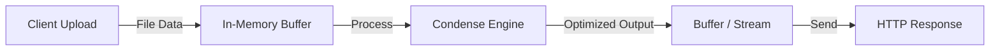

<div align="center">


[](https://www.npmjs.com/package/@studioframes/condense)
[](https://www.npmjs.com/package/@studioframes/condense)
[](./LICENSE)

**Condense is a high-performance, stateless file optimization and minification engine for [Node.js](https://nodejs.org). It optimizes images, audio, video, and code entirely in-memory using Buffers and Streams, and avoids writing temporary files to disk.**

</div>

## Introduction

Condense provides fast, in-memory optimization for media and code. It exists to offer low-latency, stateless processing for server-side and serverless environments where temporary disk I/O is undesirable or unavailable. Unlike traditional tools that rely on intermediate temporary files, Condense processes uploads and assets using Buffers and Streams, returning optimized Buffers or Streams ready to send in responses.

### Table of Contents
- <a href="#why-condense">Why Condense?</a>
- <a href="#features">Features</a>
- <a href="#supported-formats">Supported Formats</a>
- <a href="#installation">Installation</a>
- <a href="#quick-start">Quick Start</a>
- <a href="#usage">Usage</a>
- <a href="#ignore-directives">Ignore Directives</a>
- <a href="#api-reference-selected">API Reference</a>
- <a href="#architecture-diagram">Architecture Diagram</a>
- <a href="#benchmarks">Benchmarks</a>
- <a href="#system-requirements">System Requirements</a>
- <a href="#license">License</a>

## Why Condense?

- **No temporary files:** Processes files entirely in-memory using Buffers and Streams without writing temporary files to disk.
- **Stateless architecture:** Optimizations are performed per-request without persistent state, easing horizontal scaling.
- **API-friendly:** Designed to integrate cleanly into HTTP APIs and microservices.
- **Serverless-ready:** Works well in ephemeral environments (Cloud Functions, Lambda-like runtimes) where disk access is limited.
- **High-throughput:** Efficient pipelines suitable for high-volume media processing.
- **Low-latency:** Optimized for minimal added latency in request/response flows.

## Features
- In-memory Buffer & Stream processing (no temporary disk writes except when explicitly invoking `faststart`)
- Image (including AVIF & GIF), audio, video, and code/markup (including SVG) optimization
- Intelligent Dynamic Resizing via `width`, `height`, and `fit` API parameters
- Video Thumbnail Extraction and Standard MP4 Faststart utilities
- Express middleware and standalone CLI options
- Ignore directives to opt-out specific regions or files from minification
- System Health Diagnostics API (`/health`)

## Supported Formats

| Category | Formats |
| --- | --- |
| Images | `.png`, `.jpg`, `.jpeg`, `.webp`, `.avif`, `.gif`, `.svg` |
| Audio | `.mp3`, `.wav` |
| Video | `.mp4` |
| Code & Markup | `.html`, `.css`, `.js`, `.json` |

## Installation

Install with your preferred package manager:

#### npm

```bash
npm i @studioframes/condense
```

#### yarn

```bash
yarn add @studioframes/condense
```

#### pnpm

```bash
pnpm add @studioframes/condense
```

#### bun

```bash
bun add @studioframes/condense
```

## Quick Start

The simplest in-process example — optimize an image Buffer and get back an optimized Buffer:

```javascript
const { optimizeImage } = require('@studioframes/condense');

async function simpleOptimize(rawBuffer) {
  const { buffer: optimized, outMime } = await optimizeImage(rawBuffer, 'image/png', 'quality');
  // send `optimized` as the HTTP response body with Content-Type `outMime`
  return { optimized, outMime };
}

// Usage: pass a Buffer (e.g., from file upload or fetch response)
```

## Usage

Condense can run as a standalone CLI server, be mounted as Express middleware, or be used programmatically.

- CLI: `npx @studioframes/condense` (defaults to port 3000; set `PORT` to override)
- Express: mount `condenseApp` on a route to accept uploads
- Programmatic: use helpers such as `optimizeImage`, `optimizeText`, `optimizeMediaStream`

### Examples

#### Express Middleware

```javascript
const express = require('express');
const { condenseApp } = require('@studioframes/condense');

const app = express();

// Mount all optimization routes under a specific path
app.use('/v1', condenseApp);

app.listen(8080, () => {
    console.log('App running. POST files to http://localhost:8080/v1/optimize');
});
```

#### Programmatic Helper SDK

```javascript
const { optimizeImage, optimizeText, optimizeMediaStream } = require('@studioframes/condense');

// 1. Optimize an Image Buffer (returns Buffer)
const { buffer: imgBuffer, outMime: imgMime } = await optimizeImage(rawImageBuffer, 'image/png', 'extreme');

// 2. Optimize an HTML / CSS / JS Buffer (returns Buffer)
const { buffer: textBuffer, outMime: textMime } = await optimizeText(rawHtmlBuffer, 'text/html', 'quality');

// 3. Optimize Audio / Video (returns PassThrough Stream)
const { stream, outMime: mediaMime } = optimizeMediaStream(rawVideoBuffer, 'video/mp4', 'quality');
```

## Ignore Directives

Use ignore directives to prevent minification for a file or a specific region.

- `html`: add `data-condense-ignore` to any element (or `<html>` to ignore the whole document).
- `js`/`css`: add the comment `/* condense-ignore */` anywhere in the file to bypass minification.

### Examples

#### `html`

```html
<div data-condense-ignore>
  <pre>
    Preserved spacing and content here
  </pre>
</div>
```

#### `js`

```javascript
/* condense-ignore */
function legacyCode() {
    // This file will not be altered
    var x =   10; 
}
```

#### `css`

```css
/* condense-ignore */
p {
  color: red;
  text-align: center;
}
```

## API Reference (selected)

POST `/optimize`
- Multipart form: `file` (binary), `method` (`quality` | `extreme`)
- Returns optimized binary in the response body with appropriate `Content-Type`.

### Example Request:
```bash
curl -X POST http://localhost:3000/v1/optimize \
  -F "file=@./photo.png" \
  -F "method=extreme" \
  --output photo-condensed.webp
```

## Architecture Diagram



Short explanation: uploads are received into memory (Buffers or Streams), processed by Condense in-memory, and returned as an optimized Buffer or Stream without intermediate disk writes.

## Benchmarks*

| File Type | Original Size | Optimized Size |
| --- | ---: | ---: |
| `.png` | 4.2 MB | 1.1 MB |
| `.mp4` | 25 MB | 9 MB |
| `.html` | 120 KB | 42 KB |

*These numbers are illustrative. Actual savings vary depending on content, encoding, and chosen optimization method.

## System Requirements

- Minimum Node.js: >= 20.9
- Uses native binaries (`sharp`, `ffmpeg-static`) where applicable

## License

This project is managed by Studio Frames and is licensed under the Apache License 2.0. See [LICENSE](https://github.com/studioframes/Condense/blob/main/LICENSE) for the full text.
